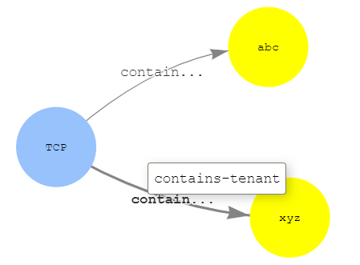
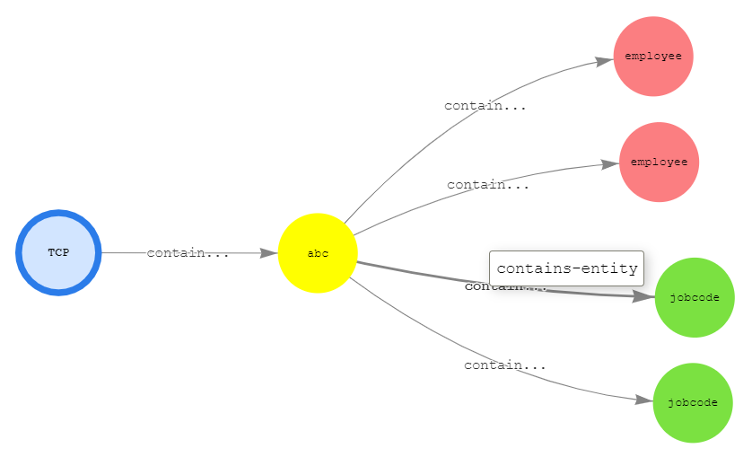
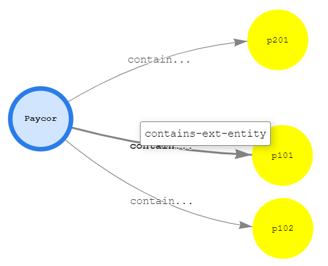
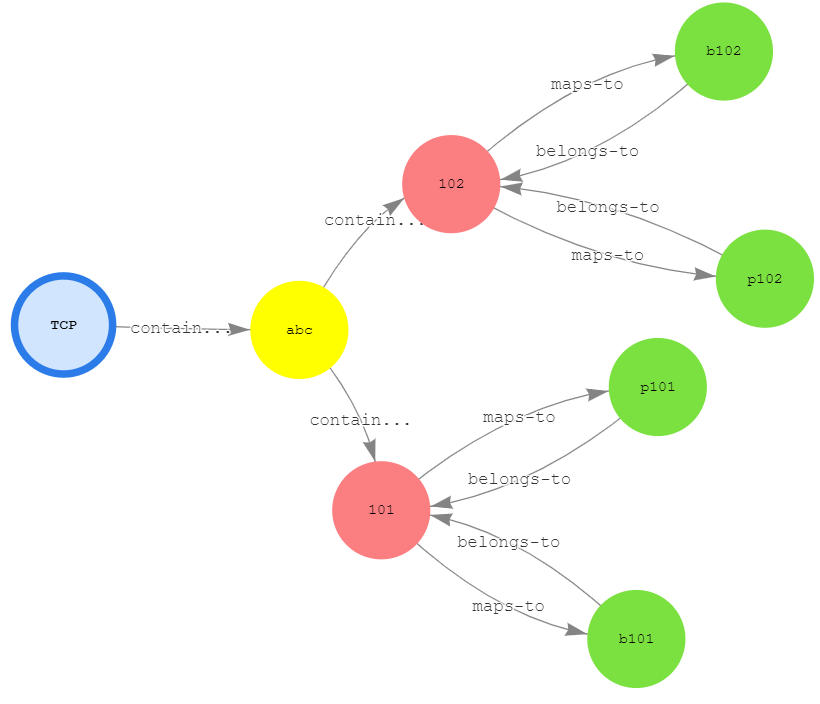
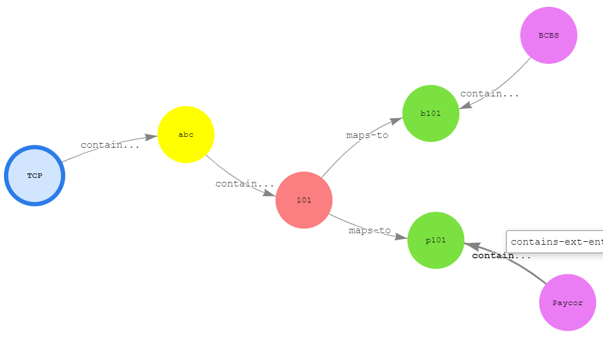
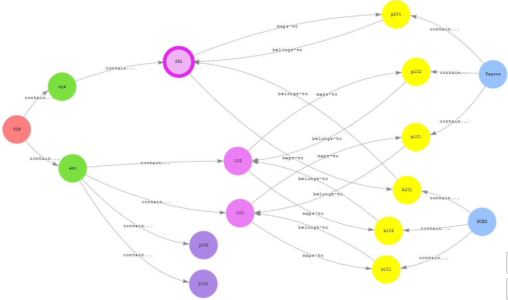

## Mapping Service PoC

This gives little bit more information about PoC in regards to Integration / Mapping Service.

### Graph Model / Data

As part of the PoC, the following schema is assumed:

> **Note:** This model is just for PoC and needs to be refactored according to our needs. The custom attributes are not assumed at the moment.

```
Vertex        | Description
------------- | -------------
sor           | System Of Record (ex: TCP)
sor-tenant    | Tenant of System of Record (ex: Tenant1 of TCP)
employee      | entity of type "Employee"
jobcode       | entity of type "Job Code"
ext-system    | Any external system which maps to entities of sor-tenant (ex: Paycor)
ext-record    | A record which is identified in ext-system (maps to entity of tenant)
```

```
Edge                  | Source            | Target
--------------------- | ----------------- | -----------
contains-tenant       | sor               | sor-tenant
contains-entity       | sor-tenant        | employee/jobcode
contains-ext-entity   | ext-system        | ext-record
belongs-to            | ext-record        | employee/jobcode
maps-to               | employee/jobcode  | ext-record

```

Sample data for the above model is available in `tenants-systems-vertices`, `data\entities-vertices.csv` and `data\mapping-edges.csv`.

### Relationship Diagram Samples

This is how we can visualize graph models using Gremlin together with Jupyter.

- A typical relationship between sor and sor-tenant could be represented in the graph model as shown below:

```
%%gremlin -p v,oute,inv -d {"sor":"name","sor-tenant":"name"}
g.V('tcp').outE('contains-tenant').inV().path().by(valueMap(true))
```



- Relationship between sor, sor-tenant and entities (employee/jobcode) could be represented in the graph model as shown below:

```
%%gremlin -p v,oute,inv,oute -d {"sor":"name","sor-tenant":"name"}
g.V('tcp').outE('contains-tenant').inV().has('name','abc').outE('contains-entity').inV().path().by(valueMap(true))
```



- Relationship between ext-system and ext-record could be represented in the graph model as shown below:

```
%%gremlin -p v,oute,inv -d {"ext-system":"name","ext-record":"recordId"}
g.V('paycor').outE('contains-ext-entity').inV().path().by(valueMap(true))
```



- Relationship between entities and external records could be represented as below:

```
%%gremlin -p v,oute,inv,oute -d {"sor":"name","sor-tenant":"name","employee":"recordId","jobcode":"recordId","ext-record":"recordId"}
g.V('tcp').outE('contains-tenant').inV().has('name','abc').outE('contains-entity').inV().outE('maps-to').inV().outE('belongs-to').inV().path().by(valueMap(true))
```



- Relationship between entities, external records and external systems could be represented as below:

```
%%gremlin -p v,oute,inv,oute,inv,oute,inv,ine,outv -d {"sor":"name","sor-tenant":"name","employee":"recordId","jobcode":"recordId","ext-record":"recordId","ext-system":"name"}
g.V('tcp').outE('contains-tenant').inV().has('name','abc').outE('contains-entity').inV().has('recordId', '101').outE('maps-to').inV().inE('contains-ext-entity').outV().path().by(valueMap(true))
```



- All vertices and edges of sample data could be represented in one graph as below:

```
%%gremlin -p v,oute,inv -d {"sor":"name","sor-tenant":"name","ext-system":"name","employee":"recordId","jobcode":"recordId","ext-record":"recordId"}
g.V().outE().inV().path().by(valueMap(true))
```



### Code Samples

We used Node.js for this PoC and covers all of the following operations:

- Count no. of vertices
- List vertices
- Add vertex/edge as part of one "statement" based transaction
- Load multiple vertices/edges
- Delete vertex/edge

The PoC also includes a quick basic sample to test connection using C#.

- Node.js samples are available in folder `sample-app-nodejs`
- C# basic connectivity sample is available in folder `c-sharp-sample`

The following are going to be step-by-step instructions on how to create Neptune Graph Db and access it from local machine.

### Gremlin Samples

- list out all vertices

```
g.V()
```

- list out all edges

```
g.E()
```

- get details of a vertex

```
g.V('tcp').properties('name')
```

- give all the edges of vertex 'tcp'

```
g.V('tcp').outE()
```

- give names of vertices which are (out) related as "contains-tenant" from vertex 'tcp'

```
g.V('tcp').outE('contains-tenant').inV().properties('name')
```

- list out entity edges of tenant 'abc' of sor 'tcp'

```
g.V('tcp').outE('contains-tenant').inV().has('name', 'abc').outE('contains-entity')
```

- list out entity record ids of tenant 'abc' of sor 'tcp'

```
g.V('tcp').outE('contains-tenant').inV().has('name', 'abc').outE('contains-entity').inV().properties('recordId')
```

- get tenant record id of an external system entity record id

```
g.V('paycor').outE('contains-ext-entity').inV().has('recordId', 'p102').outE('belongs-to').inV().properties('recordId')
```

- list out external system records of tenant entity

```
g.V('tcp').outE('contains-tenant').inV().has('name', 'abc').outE('contains-entity').inV().has('recordId', '101').outE('maps-to').inV()
```

- list out external system records of mutiple tenant entities

```
g.V('tcp').outE('contains-tenant').inV().has('name', 'abc').outE('contains-entity').inV().has('recordId', within('101', '102')).outE('maps-to').inV()
```

- list out type of entities of a given tenant

```
g.V('tcp').outE('contains-tenant').inV().has('name', 'abc').outE('contains-entity').inV().label().dedup()
```

- list out tenant entities of type employee

```
g.V('tcp').outE('contains-tenant').inV().has('name', 'abc').outE('contains-entity').inV().hasLabel('employee')
```
