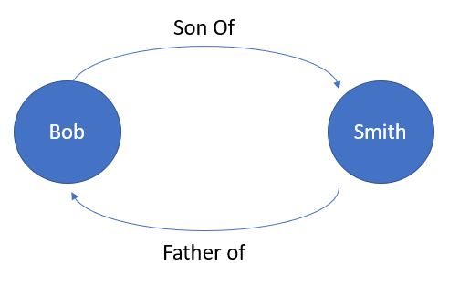

## Quick Concepts

Fundamentally, any Graph Model consists of **vertices** and **edges**. Let's take a look at following diagram:

### Vertex

A **vertex** represents **data** which could be in **relation** to other vertices. In above case, **Bob** and **Smith** can be considered as vertices. The vertices can also store more information in the form of custom attributes (like DOB, City etc.).

### Edge

An **edge** represents **relation** between two **vertices**. In the above case, "SonOf" and "FatherOf" can be considered as edges. Even the edges can contain more attributes.

### Gremlin

There are several tools to query a Graph Db. In our exercise, we are going to use **Gremlin** to interact with Neptune Db. A free book on Gremlin is available for learning:

http://kelvinlawrence.net/book/PracticalGremlin.html
