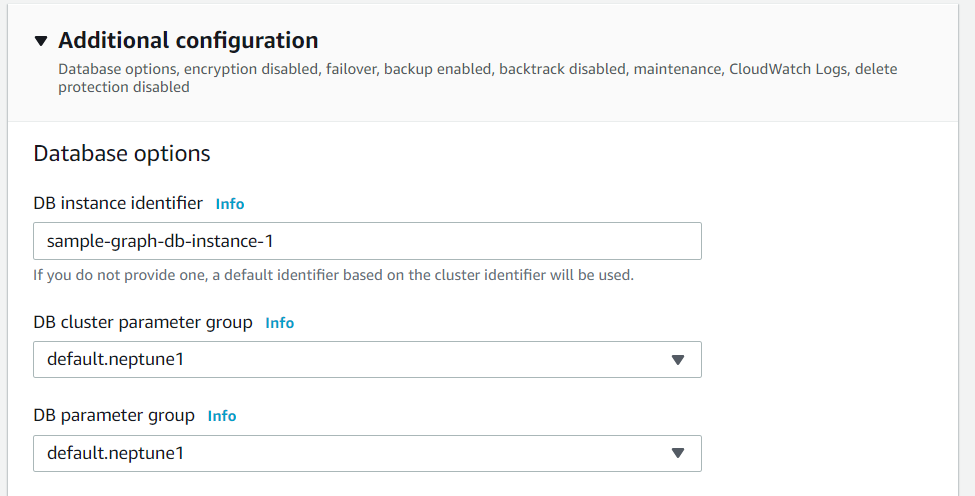
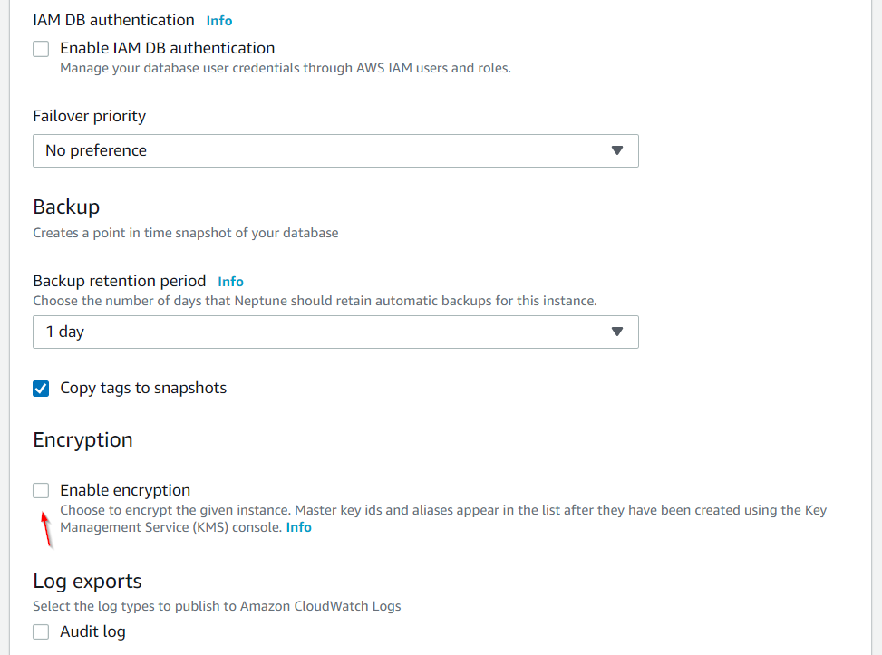
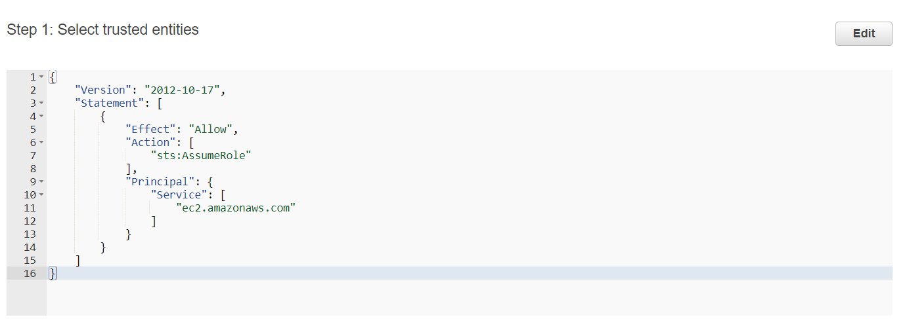
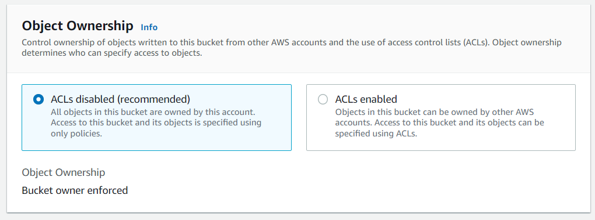
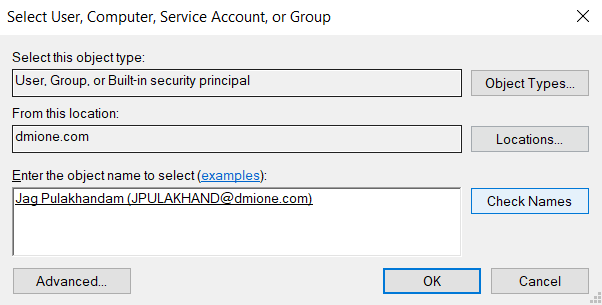
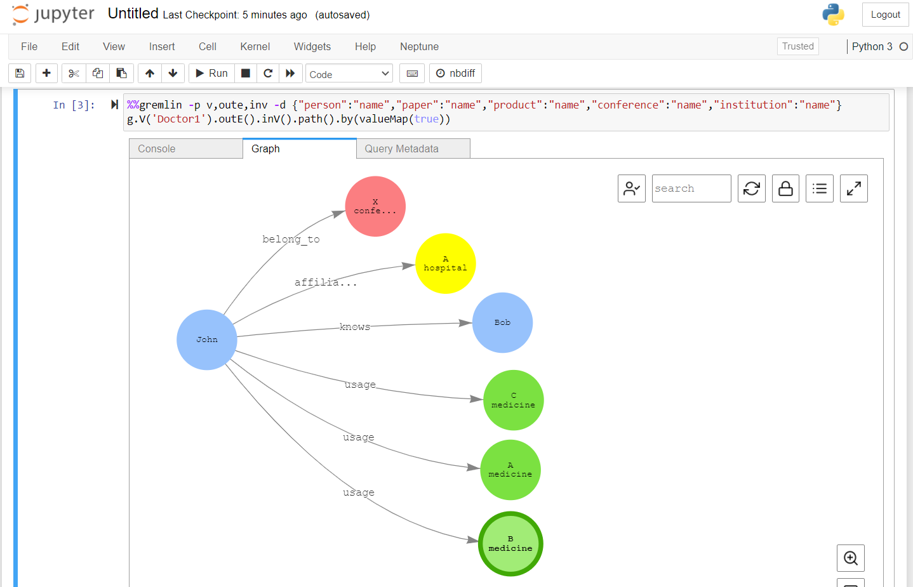

## Sample Implementation

As part of this section, we are going to implement a sample graph model from the scratch using Neptune Graph Db. This sample implementation will not have relation to Integration Id / Mapping Service. This is just only for a quick understanding on how things work.

### Sample Graph Model / Data

As part of this exercise, the following schema is going to be used:

```
Vertex        | Description
------------- | -------------
person        | Doctor or MR
paper         | Paper authored by person
product       | Medicine used by person
conference    | Affiliated academic society
institution   | Hospital, university, or company
```

```
Edge              | Source            | Target
----------------- | ----------------- | -----------
knows             | person            | person
affiliated_with   | person            | institution
authored_by       | paper             | person
belong_to         | person            | conference
made_by           | product           | institution
usage             | person            | product
```

Data for the above model is available in `data\demo-edges.csv` and `data\demo-vertices.csv`.

A typical doctor may be represented in the graph model as shown below:


### Walkthrough - Getting Started

The following are going to be step-by-step instructions on how to create Neptune Graph Db and access it from local machine.

As part of these instructions, we are going to learn about the following:

- Create Neptune Graph Db from scratch
- Creating respective AWS Role with all necessary permissions to work with Neptune, EC2 and S3
- Creating and working with Jupyter Notebook
- Uploading data files to Neptune Db through S3
- Configure Security Groups
- Create / configure VPC endpoint
- Create / configure EC2 Bastion Server to interact with Neptune Db
- Configure local machine with SSH and SSH redirection in order to access Neptune DB through EC2 Bastion Server.

The following gives you an understanding on what we are planning to implement:


### Pre-requisites

We used Windows 10 for this walkthrough and it is expected that you have all of the following configured / tested on your machine:

- AWS CLI (with your account/creds associated)
- OpenSSH Client enabled using Windows Settings (check following fig)
- Postman
- CURL.exe (usually from `C:\Program Files\Git\mingw64\bin\curl.exe`)


### Create Neptune Graph Db

- Login to AWS Console
- Search for "Neptune" and create database shown in the steps below:
  
  
  
  
  
  
  
  
  
  

- Rename VPC so that it can easily identified
  

- Rename route table so that it can be easily identified
  

- In order to access the db, we need to make a note of endpoints. Select the graph db we created earlier:
  

- And now, you should be able to see endpoints as shown below (we will use it later in up coming steps):
  

### Create AWS Role and associate it to Neptune Db

In our case, Neptune Db is going to accessed by EC2, S3 etc. We need to create a role and associate it with Neptune Db.

Following are the steps:





- Ensure it says **Allows EC2 Instances to call AWS services on your behalf** as shown below:
  

- Add more policies to the role as shown below
  

- Modify trust relationships so that it looks like the following:
  

- Associate the role to Neptune Db
  
  
  

- Make a note of ARN of the role we have created (will use it later in up coming steps)
  

### Create Jupyter Notebook

- This section is only needed if we did not opt to create Jupyter Notebook earlier.
- Following are the steps:
  
  
  
  

### Create S3 bucket and upload data files

- Following are the steps to create S3 bucket
  
  
  
  
  
  

- Upload `data\demo-edges.csv` and `data\demo-vertices.csv` files using "Upload" button. Once finished, we should be able to see the bucket as follows:


### Configure Security group

We need to configure security group in order to expose respective ports to access Neptune Db.

- Select security group related to Graph Db VPC
  

- Modify inbound rules (NOTE: The following rules are too broad in nature)
  

### Create EC2 Bastion Server

The EC2 instance we are going to create acts as the main interface to communicate with Neptune Db.

Following are the steps:


- Make sure that you select correct network, subnet, IAM Role, Security Group as created in previous steps:


- At this point, we will prompted for key pair to access EC2. It is essential to connect to EC2 through SSH. You can choose existing key pair (only if you have relevant files on your machine) or create new one as shown below:


- Ensure that .pem file is in c:\ssh for our exercise
- Rename EC2 instance so that we can easily identify it.
  

- Make a note of public DNS of EC2 (we are going to use it later):
  

### Apply permissions to .pem file

- Ensure .pem file in c:\ssh (downloaded while creating EC2)
- Apply security for the file as shown below:
  
  
  
  
  
  
  

### Create VPC Endpoint (for S3)

This endpoint gives the way to access contents from another VPC. In this case, Neptune Db has to access S3 which is outside Neptune's VPC.

Following are the steps:


- Choose the VPC of Neptune Db (which we renamed earlier after creating Neptune Db)
  

- Choose the routing table which we renamed earlier after creating Neptune Db.
  

- Provide tags and create the endpoint
  

### Connect to EC2 using SSH

- Open Windows Terminal and go to "ssh" folder (it should contain key as explained earlier)
- Connect to EC2 from local machine using following command (uses EC2 DNS and .pem files from previous steps)

```
c:\ssh>  ssh -i .\sample-graph-db-ec2-bastion-server.pem ec2-user@ec2-3-145-218-29.us-east-2.compute.amazonaws.com
```

- if the connection is successful, we remotely connected to EC2 using command line and it should show the (linux) prompt as follows:

```
[ec2-user@ip-172-30-1-184 ~]$
```

- We can now check the connection to Neptune Db as follows (check Neptune Db endpoint we noted earlier):

```
[ec2-user@ip-172-30-1-184 ~]$ curl [https://sample-graph-db.cluster-cgm0q33taffj.us-east-2.neptune.amazonaws.com:8182/status](https://sample-graph-db.cluster-cgm0q33taffj.us-east-2.neptune.amazonaws.com:8182/status)
```

- if everything works perfect, it should show the following:


### Develop from local machine

Typically, we would like to develop apps locally and connect to remote databases. As of now, we are able to connect to Neptune Db only from EC2 (using SSH). In order to achieve the local development flexibility, we would need to "redirect" (any) Neptune DB requests at OS level and forward through SSH. SSH then redirects commands through SSH connection through EC2 and further down to Neptune.

Following are the steps to achieve above:

- Modify Windows "hosts" file to add following line at the bottom:

```
127.0.0.1 localhost sample-graph-db.cluster-cgm0q33taffj.us-east-2.neptune.amazonaws.com
```

- Use following command to redirect any requests to Neptune Db through EC2 (leave it to run in the background, as long as we develop local apps):

```
c:\ssh> ssh -i .\sample-graph-db-ec2-bastion-server.pem ec2-user@ec2-3-145-218-29.us-east-2.compute.amazonaws.com -N -L 8182:sample-graph-db.cluster-cgm0q33taffj.us-east-2.neptune.amazonaws.com:8182
```

- The above redirects requests from local to SSH and further gets redirected to ec2 through Neptune Db (leave it running)
  

- Now, we should be able to test connection to Neptune Db directly from our local machine. Open browser and connect to Neptune Db as follows:

```
https://sample-graph-db.cluster-cgm0q33taffj.us-east-2.neptune.amazonaws.com:8182/status
```


- We can also use a cURL request (or Postman) to test the same:
  

- Now that we are able to connect to Neptune Db from our local machine, we can develop/debug any app using C#, Node.js etc. using our favorite tools on our machine.

- Following is a quick sample in Node.js to count no. of vertices in Neptune Db:

```
const  gremlin = require('gremlin');
const  DriverRemoteConnection = gremlin.driver.DriverRemoteConnection;
const  Graph = gremlin.structure.Graph;

dc = new  DriverRemoteConnection('wss://sample-graph-db.cluster-cgm0q33taffj.us-east-2.neptune.amazonaws.com:8182/gremlin', {});

const  graph = new  Graph();
const  g = graph.traversal().withRemote(dc);

g.V().count().next().
	then(data  => {
		console.log(data);
		dc.close();
	}).catch(error  => {
		console.log('ERROR', error);
		dc.close();
});
```

### Bulk upload data using S3

We have some data files (csv files) and we would like to load that data to Neptune Db. This can be achieved by uploading files to S3 and using GET/POST interface of Neptune Db.

We have already uploaded data files in previous steps. Following are the steps to upload the files using Postman.

- For this exercise we will use Neptune Db "loader" http endpoint as follows:

```
https://sample-graph-db.cluster-cgm0q33taffj.us-east-2.neptune.amazonaws.com:8182/loader
```

- Make sure that for any request, **Auth** is setup as follows:


- Use following JSON (as message body) to upload `demo-vertices.csv` (uploaded earlier to S3) to Neptune Db (we are using ARN of the role we noted earlier):

```
{
	"source" : "s3://test-sample-graph-db/demo-vertices.csv",
	"format" : "csv",
	"iamRoleArn" : "arn:aws:iam::047554574018:role/sample-graph-db-role-for-access",
	"region" : "us-east-2",
	"failOnError" : "FALSE",
	"parallelism" : "MEDIUM",
	"updateSingleCardinalityProperties" : "FALSE",
	"queueRequest" : "TRUE"
}
```

- Issue a POST request using above JSON through Postman as follows:


- The response (if successful) contains "loadId" and can be used to check the status of the loading request issued using following:


- Let's do the same for `demo-edges.csv` as well:
  
  

- At this point, the data should be uploaded and could be retrieved using any app (or using the code sample provided in previous section)

### Using Jupyter Notebook for querying / visualization

- Ensure Jupyter Notebook is created as shown earlier
- Using AWS Console, open the notebook
  

- Create a new **Python 3** file to use it as test pad for querying / visualization:
  

- We can issue Gremlin queries like `g.V()` as shown below:
  

- We can even visualize graphs using Jupyter as shown below:
  
